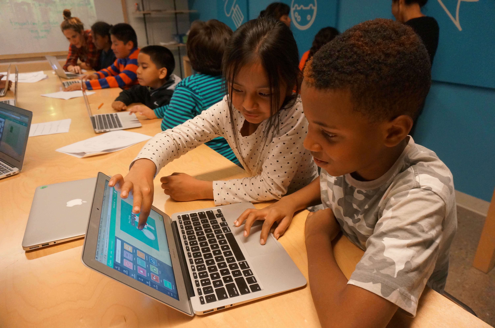

# Robotics

Robotics combines engineering and programming to create machines that are capable of performing tasks autonomously. Our robotics curriculum includes lessons plans, worksheets, and custom-designed games to teach foundational programming and problem solving skills with LEGO Mindstorms EV3.

### Lessons

* [build and prep](lesson-plans/lesson-1.md)
* [move block](lesson-plans/lesson-2.md)
* [move block computer](lesson-plans/lesson-3.md)
* [design thinking](lesson-plans/lesson-4.md)
* [the cowardly robot](lesson-plans/lesson-5.md)

### Download lesson plans

[Download](./robotics.pdf)

### Workbook

[Download](workbook.pdf)

### Suggested classroom protocol

[Download](classroom-protocol.pdf)

### Running programs on the EV3 tutorial

[Download](download-instructions.pdf)

### EV3 software

[Link to download](http://www.lego.com/en-us/mindstorms/downloads/download-software)
