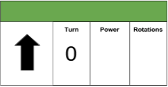
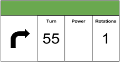
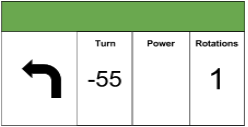







This lesson serves as an introduction to programming using the EV3 software (this is useable with the older NXT bricks as well). Students have their first programming challenge to guide their teacher through a maze using programming instructions.




- Students will decompose a problem
- Students will be able to use decomposed elements to solve a problem




#### Length: 45 minutes

1. Explore
2. Programming
3. Building




- **decompose** - the act of developing a problem story, identify the requirements to solve the problem, and form a plan to connect the required components.
- **sequence** - the order in which the coding elements are executed




- Lego Mindstorm Kit
- Completed Mindstorm Robot (from lesson 1)
- Computer with EV3 Software
- Programming Instruction Video
- Teacher-created Maze with Duct Tape (2 colors)
- [Move block cut outs][worksheet1]

### Lesson Prep:
  - Print and cut [Move block cut outs][worksheet1]
  - Make a teacher maze using tape on the floor.

  Example:

  







Introduce the idea of being a programmer to students by watching videos and having a group discussion.

**Prep:**
  - Set up projector
  - Cue up videos



1) Start a discussion with students by asking, "What do programmers do?"

Programmers give detailed instructions to computers to solve problems and accomplish tasks.
2) Watch: A Day in the Life of a Software Engineer: https://www.youtube.com/watch?v=vt79JcPfZQA
3) Why is it important to have a diverse group of people creating software for the world?
4) Watch: A Day in the Life of a Roboticist: https://www.youtube.com/watch?v=90Z3cFzV_j4
5) How does learning how to code play a role in making robots?

,,,

1) Students raise their hands to provide answers.
2) Students watch the video.
3) Students raise their hands to provide answers.
4) Students watch the video.
5) Students raise their hands to provide answers.









Introduce programming with an exercise on paper called teacher robot.



1) Show students the maze and explain the first step to solving a problem is to **decompose** the problem. Decomposition consists of developing a problem story, identify the requirements to solve the problem, and form a plan to connect the required components.
2) Ask the students to come up with a story to explain what the problem is that they are facing.
3) **Guided discussion**

Target: “The robot needs to get from the start zone to the finish zone.”
4) Ask students to turn to a person sitting next to them and discuss the requirements (what the robot needs to be able to do) for achieving their goal.
5) **Guided discussion**

Target:
- Move forward
- Turn right
- Turn left
6) What do those three requirement have in common? Is it possible to describe them all as moving the wheels of the robot?

- What is the difference between the movements?
- What do you need to be able to change about the movement to allow for turning and covering different distances?
7) **Guided discussion**

Target:
- Rotation (distance)
- Turn (angle)
8) Give each student a set of the [move block cutouts][worksheet1]. The move block can control:

- steering - turning direction (already filled in)
- power - how fast the robot moves
- rotations - how far to move

9) As a group discuss what each of the three different move blocks mean.

  

  **move forward**

  

  **turn right 90 degrees**

  

  **turn left 90 degrees**
10) Tell students to create a sequence (from left to right) of blocks to program the teacher robot to solve the maze. The teacher robot performs the student instructions. If there are bugs, return the paper to the student.

How to be teacher robot:
  - Forward: Walk forward one box for each rotation
  - Turn left: turn 90 degrees left (this does not move you to a new space)
  - Turn right: turn 90 degrees right (this does not move you to a new space)

```
Make sure to follow student instructions exactly as they are written!
```

,,,

2) Students develop a problem story
4) Students discuss with their partner the requirements to achieve the goal.
10) Students develop and create a list of commands using their move block cutouts. When they are done, the teacher reads and enacts their list of instructions.









Introduce students to building attachments.



1) Show students the maze again and explain that their robot has to push a lego through the maze. To accomplish this, students need to build an attachment.

```
An attachment is an additional piece that can be added onto a robot to help it achieve new goals.
```
2) Give students 2 minutes to brainstorm problems their current robot might have while trying to push a lego.
3) **Guided Discussion**

Target:
- Lego gets stuck under robot
- Lego slides off to the side
- Lego blocks wheels
4) **Think** To develop a solution, students start by  sketching 3 ideas on a piece of paper.
5) **Pair** Put students in groups of 2
6) **Share** Tell students to share their sketches and explain how each design deals with the problems the class discovered.
,,,

2) With a partner, students brainstorm problems that the robot might run into while trying to push a block.
3) Students offer answers by raising their hands.
4) Each student sketches 3 ideas for their attachment.
5) Students sit with a partner.
6) Students share their sketches and explain how each design deals with the problems the class discovered.



[worksheet1]: ../worksheets/lesson2-worksheet1.pdf
