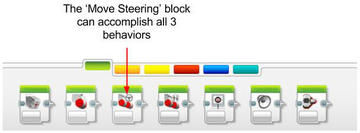







Students continue learning about simple and complex behaviors by programming their Mindstorm robots. Start by teaching how to program in the EV3 environment and download programs to the robot for testing. Students demonstrate learning by giving their robots commands to navigate a maze.




1. Students will be able to create a sequence on the computer.
2. Students will be able to use the move block.




#### Length 45 minutes

1. Explore - Watch a video of a robot and discuss the importance of building in robotics.
2. Explain - Show students how to program the robot in the EV3 software.
3. Engage - Students program their robots to solve the maze.







1. Finished robot
2. Hand written program and lego attachment from [move block lesson](./lesson-2.html)
3. Computer with EV3 Software
4. [Move Steering Handout](../worksheets/lesson3-worksheet1.pdf)
5. Teacher-created Maze
6. [Iteration Log](..worksheets/x-iteration-log.pdf)







Watch a video of a good lego robot and discuss the importance of building.



1) Show the [video](https://www.youtube.com/watch?v=wzDjg595AiU) of the world champion robot from 2013-14 First Lego League challenge as an example of a very well designed and programmed EV3 robot.
2) Discuss with students the importance of combining good engineering and good programming.

,,,

1) Students watch the video.
2) Students raise their hands to offer answers.









Show students how to program the robot in the EV3 software.

**Prep:**



1) Distribute the Move Steering handout and show students the maze that the robot has to navigate.
2) What do you think the blanks on the handout are used for when programming the robot?
3) **Guided Discussion**
  - Turning: Positive numbers turn right, Negative numbers turn left, and 0 means straight.
  - Power: How fast the motor spins. 0 is the slowest; 100 is the fastest.
  - Duration: How long the motor turns on for in rotations. 1 rotation is one full spin of the motor.

4) To create a sequence, connect multiple blocks together from left to right
Give students time to complete the rest of the handout.
5) Show students the EV3 software and demonstrate where to find the Move steering block

6) Show students the iteration log and ask students about why it is important to identify where in their code a bug occurred.
7) Show students the iteration log and ask students about why it is important to identify where in their code a bug occurred.

,,,

3) Students fill in the 3 parts of the Move Steering block on their handout:
  - Turning: Positive numbers turn right, Negative numbers turn left, and 0 means straight.
  - Power: How fast the motor spins. 0 is the slowest; 100 is the fastest.
  - Duration: How long the motor turns on for in rotations. 1 rotation is one full spin of the motor.
5) On the handout, students describe the behaviors for each move steering block. The finished answer should look like this:









Students program their robots to solve the maze.



1) Tell students to get a computer, open the Mindstorm EV3 software, and create a new program.
2) Ask students what they notice about all of the turns on the maze? What parts of the move block do they need to it to change how much the robot turns?
3) **Guided discussion**

Target:
  - All of the turns are 90 degrees
  - Students will need to adjust turn and rotation to successfully complete a turn.
4) Tell students that their first goal is to edit a move block on their computer to complete a 90 degree turn.
5) Student create a program to solve the maze. The goal is to create the robot that finishes the maze the quickest.

,,,

1) Students get a computer, open the Mindstorm EV3 software, and create a new program.
3) Students raise their hands to give answers.
4) Students can now begin programming their robot to complete a 90 degree turn.
5) Students begin programming their robot to complete the maze from previous lesson.
  - Students should use their program (the written down instructions) from the ‘teacher robot’ activity to help organizing the behaviors for the actual maze challenge.
  - Students keep a log of where each attempt could be improved using their iteration log handout.


