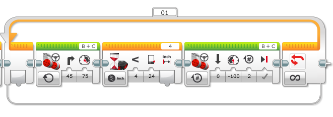







In this lesson, students learn about loops, event handlers, and practice design thinking.

##### [Download Lesson](../lessonPDFs/the cowardly robot.pdf)




Students will be able to
 - Define and utilize a loop
 - Define and utilize event listeners (wait block)
 - Practice design thinking




#### Length: 90 minutes

1. Explore - Introduce students to sensors
2. Explain - Show students how to program the sensors
3. Engage - Students use knowledge to program their robot




- **Loop** - A block of code that repeats.
- **Event handler** - Code that runs after a specific input.




- Lego Mindstorms
- [Lesson 5 | Worksheet 1][worksheet1]
- Iteration log







Introduce students to the concept of sensors.

**Prep:** Set up projector with video https://www.youtube.com/watch?v=8df0OemCLFo



1) Watch - https://www.youtube.com/watch?v=8df0OemCLFo Sumo bots example
2) **Guided discussion** - Now that students have tested their robots sumo prowess in the last lesson, what could make their robots better fighters?

Target: Sensors! (and updating their build designs)
3) Relate human senses to robotic sensors and discuss how those senses can be used to react to external stimuli.
4) Discuss with students how people use their senses to react to their environment
  - What would you do if something was chasing you?
  - What of your senses do you use to know if something is chasing you?
5) Explain that the robot uses sensors to mimic human senses and allow it to react to its surroundings.
6) Show students the ultrasonic sensor and ask what they think this sensor might be used for. Explain that it is similar to the eyes of the robot. It allows your ev3 to measure distance.

,,,

1) Students watch the sumo bots video
2) Students raise their hands to provide answers.
4) Students raise their hands to provide answers.









Explain the goal for the robot and show students how to use the sensors in the EV3 software.



1) Explain the goal for this class is to make the cowardly robot.
2) The robot should run away whenever something is closer than 2 feet.
3) If the robot does not see anything that close, it continuously spins so it can not be snuck up on.
4) Distribute [Lesson 5 | Worksheet 1][worksheet1] and set up a projector that has it displayed. Students work on finding the difference between the two move blocks. When students have finished individually working on the questions, they discuss their answers with a partner.
5) **Guided Discussion** - What is the difference between the two move blocks?

Target: The image on the left has more options because it has a number of rotations. The block on the right is set to move forever.
6) **Guided Discussion** - What input makes the robot decide to run away? Which sensor provides that input?

Target: The ultrasonic sensor measuring that an object is closer than 24 inches.
7) On the projector, introduce students to the orange flow control tab. To add an event handler grab the wait block. The wait block will let the robot continue what it has been doing (turning forever) until a specified event happens. In the case of the cowardly robot, it can be customized to use the ultrasonic sensor.
8) To repeat a set of actions put them inside of a loop (also inside of the orange tab).
,,,

2) Students fill in their worksheet.
3) Student raise their hands to provide ideas.
4) Student raise their hands to provide ideas.









Students build and program their robots.

**Prep:**



1) Explain that students need to find a way to attach the ultrasonic sensors to their robot. The ultrasonic sensor should be plugged into port number 4 on the robot and needs to have a clear line of sight in front of it.
2) Tell students to program their robots. Remind them that the robot needs to be able to:
  1. Turn forever
  2. Wait for the ultrasonic sensor to measure an object closer than 24 inches
  3. Run away
  4. Repeat 1-3
3) Students test their robots to make sure it runs away.
4) If students finish early they should try to use the touch sensor and color sensor.

,,,

1) Students work on attaching the ultrasonic sensor.
2) Students program their robot.
3) Students test their robots.
  - Students keep a log of where each attempt could be improved using their iteration log handout.



#### Code reference (for teacher)

[worksheet1]: ../worksheets/lesson5-worksheet1.pdf
