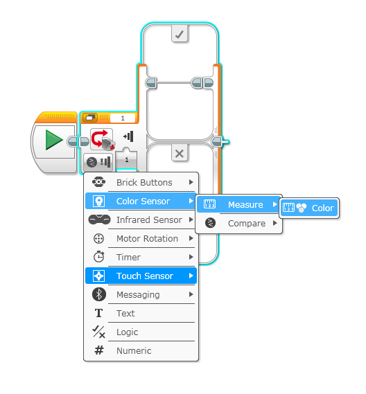
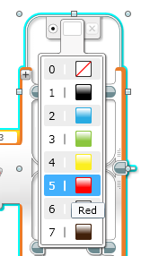
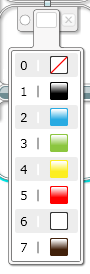
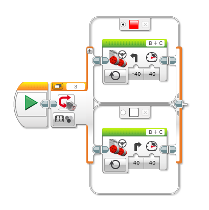
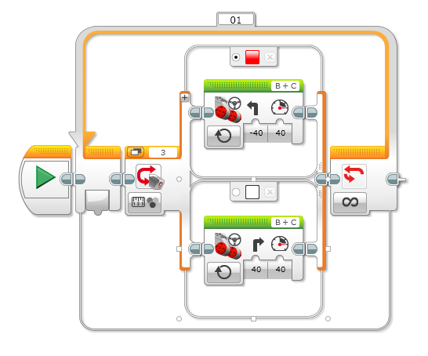







Students learn about switch statements while creating a robot that can follow a line.

##### [Download Lesson](../lessonPDFs/line follower.pdf)




Students will be able to use a switch statement.




#### Length: 90 minutes

1. **Explore** - Get students thinking about how a red line can help their robot navigate to a desired location.
2. **Explain** - Show students the line and demonstrate the simple behaviors needed to program a robot to follow the line.
3. **Engage** - Students build an attachment for the color sensor and program their robot.




**Switch statement** - A type of selection that changes the flow of a program based on the value of a variable or expression.




- Lego Mindstorm Kit
- Computer with EV3 Software
- Iteration Log







Get students thinking about how a red line can help their robot navigate to a desired location.



1) Set up the projector and show students the the video of the google self driving car. Ask follow up questions:

1. Is the google car a robot?
	- yes - the car uses its sensors and programming to drive autonomously (by itself)
2. What are some reasons the self driving car could be safer than a normal car?
	- It can see in 360 degrees
	- It can not be distracted
3. What are some similarities between the car and our robots.
	- They both need to be able to navigate on their own.
2) Show students the red masking tape maze that the robot needs to navigate through and ask the following questions.

1. What markers on the robot playing surface could help navigate the robot?
	- Red lines placed on the field mat can help the robot decide where to move.
2. Which sensor can allow the robot see those red lines?
	- The color sensor can detect the colors on the mat are.

,,,

1) Watch the video of the google self driving car and answer the questions
2) Raise their hands to answer questions








Show students the line and demonstrate the simple behaviors needed to program a robot to follow the line.



1) With a turned off robot, demonstrate the situations the robot will face and what students think the robot should do in those situations.

- The robot is to the right of the line:
	- Turn left
- The robot is on the line:
	- Turn right
2) Student's first idea is often to go straight when the robot is on the line. Explain that when the line curves to the right, the robot would go off the path and the turn to the left.
3) With the strategy figured out, teach students about the the programming blocks required to execute this strategy.

1. The switch statement takes the readings from the sensor and breaks it into two possible cases, just like the two rules in our strategy.
2. For the color sensor, the two cases are **red** or **not red**. To set up the switch:
	- Select the color sensor
	- Click on measure
	- Select color
	
3. Change the color of the top track to red
	
4. Change color of the bottom track to white

	
5. Using the previously discussed strategy as the guide, add the move steering blocks. Make sure to set the move steering blocks to ‘On’.  The finished product should look like:
	
4) Ask, "How can you make that process repeat indefinitely?"
- Put that entire switch statement in a loop so that the process repeats forever. If there is no loop it will move once and be done.
	
,,,

1) Students raise their hands to provide answers.
3) Students watch as the teacher previews the code.
4) Students raise their hands to provide answers.









Students build an attachment for the color sensor and program their robot.



1) Remind students about the goal for their robot.
2) Tell students to build an attachment for the color sensor.
3) Once students have finished their attachment they can start programming their robot.
- After each attempt, students should write down what work and what they should change using the iteration log handout.
- When everyone is done, have a competition and time each of the robots.
4) The robot that completes the entire maze the quickest is the winner.

,,,

2) Students build their attachment for the color sensor.
- It is important that the color sensor be faced toward the ground (where the line is).
- The color sensor should be close to the ground (within 1/2 inch). If it gets too close though, it will not work.
3) Students program their robot using the switch statement.



> To change the speed of the robot the students need to alter the values of the turning and the power in the move blocks.

